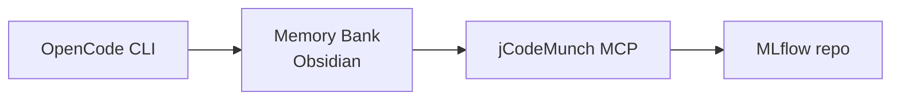

# Daha Zeki Çalış, Daha Çok Değil

Ajanlarla Çalışmak: Ücretsiz Araçlarla AI Geliştirme Atölyesi

<div class="abs-bl m-8 text-gray-400 flex items-center gap-4 text-sm">
  <span>EPAM</span>
  <span>·</span>
  <span>DataDays 2026</span>
  <span>·</span>
  <span>@gokhanozdemir</span>
</div>

<div v-drag="'qr'" class="abs-br m-8 text-center text-xs text-gray-400">
  <div class="w-20 h-20 border-2 border-gray-400 rounded flex items-center justify-center text-gray-500 text-3xl">
    QR
  </div>
  <div class="mt-1">Workshop Repo</div>
</div>

<!--
Kendini tanıt. EPAM'ın DataDays 2026 sponsoru olduğunu kısaca belirt.
-->

---
layout: center
---

*"Kahoot'u bitirdik — şimdi **SİZDEN** öğrenmek istiyorum"*

<!--
"El kaldırın" çerçevesiyle geç. Kahoot enerjisini ankete taşı.
-->

---
layout: default
---

<SurveySlide />

<!--
Her seçeneği sesli oku.
"Bu seçim şu slaytları açıyor" de — dinamik içeriği vurgula.
Eller kalktıkça kutucukları işaretle.
-->

---
layout: statement
---

"Hiç AI'dan, daha önce hiç görmediği bir kod tabanını anlamasını istedikten sonra — onu güvenle saçmaladığını izlediniz mi?"

<div v-click class="mt-10 text-2xl text-gray-400 italic">
  Ben izledim. İşte öğrendiklerim.
</div>

<!--
Soruyu oku, dur. Ellerin kalkmasını bekle.
Sonra v-click ile punch line'ı aç.
-->

---
layout: two-cols
---

# AI'ın Bildikleri

<v-clicks>

- Açık kaynak GitHub repoları
- Stack Overflow yanıtları
- Dökümantasyon siteleri
- Kamuya açık her şey

</v-clicks>

::right::

# AI'ın Bilmedikleri

<v-clicks>

- **Senin** kod tabanın
- Aldığın mimari kararlar
- Kapalı kaynak kütüphanelerin
- Şirket içi konvansiyonlar

</v-clicks>

<!--
Bu bir bug değil — tasarımsal bir kısıt.
-->

---
layout: quote
---

"İlk çözümüm: markdown notlar, parmaklar çapraz, AI iyi zar atsın diye dua."

<div class="text-right mt-4 text-gray-400">— Ben, 3. sprint</div>

<!--
Dur. Gülüşmeleri bekle. Bu an tanıdık gelmeli.
-->

---
layout: default
---

<div class="text-center mt-8">
  <div class="text-7xl font-black tracking-tight">Memory Bank</div>
  <div class="text-2xl text-gray-400 mt-6">
    Yapılandırılmış Markdown dosyalar.<br>
    Hem sen hem AI okuyabilir. Hepsi bu.
  </div>
  <div v-click class="mt-10 text-xl text-blue-400 font-medium">
    Cerrahi kod erişimi ekle → AI artık kıdemli bir geliştirici gibi geziyor
  </div>
</div>

<!--
Cengiz Han / AI Native Engineering 201 referansı.
"Kıdemli geliştirici" analojisini vurgula.
-->

---
layout: section
---

# Hep Birlikte Şimdi İnşa Edelim

<!--
Enerji geçişi. Dizüstü bilgisayarları açmalarını davet et.
-->

---
layout: two-cols
---

# Stack Genel Bakış



::right::

<v-clicks>

- **OpenCode** — Ücretsiz, terminal tabanlı AI kodlama ajanı
- **Memory Bank** — AI'a kalıcı bağlam veren Markdown dosyalar
- **jCodeMunch** — Kod tabanını indeksler, yalnızca gerekeni getirir
- **MLflow** — Bugün birlikte gezeceğimiz gerçek dünya kod tabanı

</v-clicks>

<div class="mt-6 text-sm text-gray-400">
  <code>github.com/mlflow/mlflow</code>
</div>

<!--
Araçlar arası ilişkiyi akışta göster.
-->

---
layout: default
---

<script setup lang="ts">
import { survey } from '@/setup/survey'
</script>

# Adım 1: Fork & Clone

```bash
# Repo'yu fork et ve klonla
git clone https://github.com/YOUR-HANDLE/datadays2026-workshop
cd datadays2026-workshop
```

<TerminalCheatSheet v-if="survey.terminal === 'nope'" class="mt-4" />

<!--
"Bu repo'da memory bank iskeleti zaten hazır — sıfırdan başlamıyoruz."
Terminal konforunu yokla — TerminalCheatSheet otomatik açılır.
-->

---
layout: default
---

# Adım 2: Bağlam Olmadan AI

```bash
opencode
> MLflow bir artifact'ı nasıl kaydediyor? Tam kod yolunu göster.
```

<div v-click class="mt-6 p-4 bg-red-950/30 border border-red-700/50 rounded-lg font-mono text-sm text-gray-300">
  "MLflow'da artifact kaydetmek için <code>mlflow.log_artifact()</code> kullanabilirsiniz.
  Bu fonksiyon genellikle <code>mlflow/tracking/client.py</code> içinde tanımlanmıştır
  ve <code>ArtifactRepository</code> sınıfını çağırır..."
  <span class="text-gray-500"> [47 dosya okundu, yanıt devam ediyor...]</span>
</div>

<div v-click class="mt-4 flex items-center gap-3">
  <div class="px-4 py-2 bg-red-700 rounded-full font-bold text-white text-lg">
    ~70.000 token 🔴
  </div>
  <div class="text-gray-400 text-sm">Belirsiz cevap · Uydurulmuş fonksiyon isimleri · Dosya referansı yok</div>
</div>

<!--
İzleyicilerin belirsizliği fark etmesini bekle.
-->

---
layout: two-cols
---

# Adım 3: Memory Bank'i Kur

```
datadays2026-workshop/
├── memory-bank/
│   ├── projectBrief.md
│   ├── techContext.md
│   ├── activeContext.md
│   └── systemPatterns.md
├── mlflow/
└── .opencode/
    └── config.json
```

::right::

```markdown
# projectBrief.md

## Proje Nedir?
MLflow — ML lifecycle yönetim platformu.
Experiment tracking, model registry,
deployment araçları içerir.

## Kime Hitap Eder?
Veri bilimciler ve ML mühendisleri.

## Temel Özellikler
- Experiment tracking
- Model Registry
- MLflow Projects
- MLflow Models
```

<!--
"5 dakikada doldurulur. Proje değişmedikçe bir daha dokunmazsın."
-->

---
layout: default
---

# AI'a Memory Bank'ini Kendin Yaptır

Repoyu klonladıktan sonra OpenCode'a bu promptu ver:

```text {monaco}
Sen bir proje dokümantasyon uzmanısın.
Aşağıdaki repo yapısını ve README dosyasını incele.
Sonra benim için şu dosyaları oluştur:

1. memory-bank/projectBrief.md
   - Projenin amacı, kime hitap ettiği, temel özellikler

2. memory-bank/techContext.md
   - Kullanılan dil ve framework'ler, kurulum adımları, bağımlılıklar

3. memory-bank/activeContext.md
   - Aktif modüller, bilinen TODOlar, açık issues

4. memory-bank/systemPatterns.md
   - Mimari kararlar, kodlama kuralları, önemli patternlar

Her dosyayı Markdown formatında yaz.
Sadece repoda gerçekten var olan bilgileri kullan, tahmin etme.
```

<div v-click class="mt-3 p-3 bg-green-900/30 border border-green-600/50 rounded-lg text-sm">
  Bu prompt MLflow reposu için ortalama <strong>4.200 token</strong> harcar.
  Sonucu bir kez üretirsin, sonsuza kadar kullanırsın.
</div>

<!--
Bunu canlı olarak demoyla göster — promptu çalıştır, oluşturulan dosyaları Obsidian'da göster.
-->

---
layout: image-right
image: https://images.unsplash.com/photo-1507925921958-8a62f3d1a50d?w=800
---

# Obsidian'da Nasıl Görünür

- Her dosya birbirine **backlink** ile bağlı
- Agent aynı dosyaları okuyup güncelleyebilir
- Sen de okuyabilirsin — sade Markdown

```md
# projectBrief.md
...proje özeti...

Bkz: [[techContext]] · [[systemPatterns]]
```

<div class="mt-4 text-sm text-gray-400">
  Graph view'da tüm bağlantıları görselleştir
</div>

<!--
Obsidian'ı canlı aç, graph view'ı göster — zaman izin verirse.
-->

---
layout: default
---

# Adım 4: jCodeMunch'ı Bağla

````md magic-move
```bash
# jCodeMunch olmadan
opencode
> MLflow bir artifact'ı nasıl kaydediyor?

# Sonuç: 47 dosya okundu · 70.000 token · belirsiz cevap
```

```bash
# jCodeMunch + Memory Bank ile
opencode
> MLflow bir artifact'ı nasıl kaydediyor?

# jCodeMunch: log_artifact() bulundu → artifact_repo.py:L234
# jCodeMunch: ArtifactRepository bulundu → store/abstract_store.py:L89

# Sonuç: 2 dosya · 4.800 token · satır numaralı kesin cevap
```
````

<!--
Bunu sadece slayt olarak değil, canlı olarak da demoyla göster.
Farkı net hissettir.
-->

---
layout: fact
---

# <span v-mark.circle.orange="1">16×</span>

daha ucuz · daha hızlı · halüsinasyon yok

<div class="text-xl text-gray-400 mt-4">
  70.000 token → 4.800 token. Aynı soru. Daha iyi cevap.
</div>

<!--
Dur. Rakamın yerleşmesini bekle.
Sonra circle animasyonunu tıkla.
-->

---
src: ./pages/section-setup.md
---

---
src: ./pages/section-memory.md
---

---
src: ./pages/section-context.md
---

---
src: ./pages/section-sync.md
---

---
layout: default
---

# Senin Görevin

Datathon sırasında şunu dene:

```text
jCodeMunch kullanarak [projenin temel fonksiyonu]'nun nasıl
çalıştığını tek bir dosyayı manuel olarak açmadan bul.
```

<div v-click class="mt-6 text-xl text-blue-300">
  Sonra bulduklarını <code>memory-bank/activeContext.md</code>'ye ekle.
</div>

<!--
Meydan okuma net ve somut olsun.
-->

---
layout: two-cols
---

# 3 Çıkarım

<v-clicks>

1. **Önce dokümantasyon** — Feature geliştirmeden önce memory bank'ini kur
2. **AI'a az ver** — Cerrahi erişim, tüm dosyaları dökmekten iyidir
3. **Bilginin sahibi ol** — Tek bir araca bağımlı olma

</v-clicks>

::right::

<div class="flex flex-col items-center justify-center h-full gap-4">
  <div class="text-5xl font-black text-blue-400">EPAM</div>
  <div class="text-gray-400 text-center text-lg">Bizimle çalışmak ister misin?</div>
  <div class="text-sm text-gray-500 text-center mt-2">epam.com/careers</div>
</div>

<!--
Çıkarımları yavaş aç — her biri bir tık.
EPAM kısmı ince tutulsun, zorlamadan.
-->

---
layout: end
---

# Teşekkürler!

<div class="grid grid-cols-2 gap-8 mt-8 text-center">
  <div>
    <div class="text-sm text-gray-400 mb-2">İletişim</div>
    <div class="font-mono text-blue-300">@gokhanozdemir</div>
    <div class="text-sm text-gray-500 mt-1">LinkedIn · GitHub</div>
  </div>
  <div>
    <div class="text-sm text-gray-400 mb-2">Workshop Repo</div>
    <div class="font-mono text-blue-300 text-sm">github.com/[handle]/datadays2026-workshop</div>
  </div>
</div>

<!--
Soruları bekle. Repo linkini tekrar paylaş — QR kodu göster.
-->
