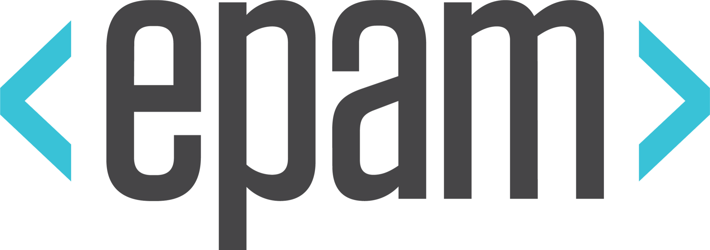
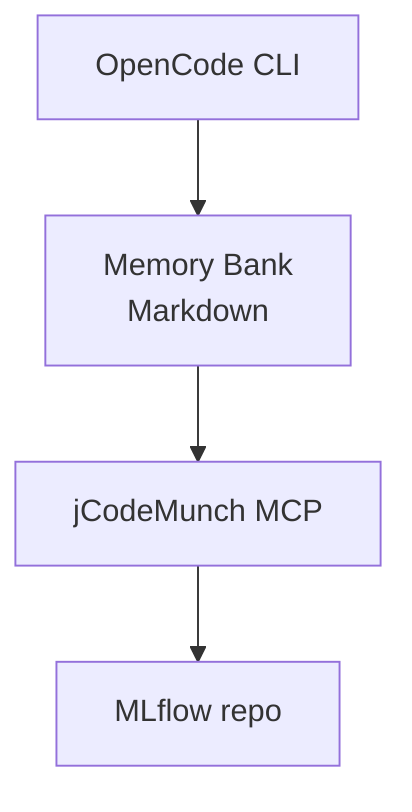

<div class="cover-grid" />
<div class="cover-glow" />

<div class="flex flex-col justify-center h-full pl-2">

<div
  v-motion
  :initial="{ opacity: 0, y: -16 }"
  :enter="{ opacity: 1, y: 0, transition: { duration: 500 } }"
  class="step-label mb-6 flex items-center gap-2"
>
  <span class="epam-logo-badge"></span>
  <span>× DataDays 2026</span>
</div>

<div
  v-motion
  :initial="{ opacity: 0, x: -30 }"
  :enter="{ opacity: 1, x: 0, transition: { duration: 650, delay: 80 } }"
>
  <h1 class="text-7xl font-black leading-tight tracking-tight">
    Daha Zeki Çalış,<br>
    <span class="text-gradient">Daha Çok Değil</span>
  </h1>
</div>

<div
  v-motion
  :initial="{ opacity: 0, y: 18 }"
  :enter="{ opacity: 1, y: 0, transition: { duration: 550, delay: 250 } }"
>
  <div class="divider-accent mt-7 mb-5" />
  <p class="text-xl text-gray-400 leading-relaxed max-w-lg">
    Ücretsiz araçlarla AI agent'ları kurma<br>
    ve onlara proje hafızası verme atölyesi
  </p>
</div>

</div>

<div class="abs-bl m-8 text-gray-600 flex items-center gap-3 text-sm font-mono">
  <span>Gökhan Özdemir</span>
  <span class="text-gray-700">·</span>
  <span>@gokhanozdemir</span>
</div>

<div v-drag="'qr'" class="abs-br m-8 text-center text-xs text-gray-500">
  <div class="w-20 h-20 rounded-xl overflow-hidden bg-white p-1.5">
    
  </div>
  <div class="mt-2 tracking-wide">Workshop Repo</div>
</div>

<!--
Kendini tanıt. EPAM'ın DataDays 2026 sponsoru olduğunu kısaca belirt.
-->

---
layout: center
transition: fade
---

<div class="flex flex-col items-center gap-8">

<div
  v-motion
  :initial="{ opacity: 0, y: -12 }"
  :enter="{ opacity: 1, y: 0, transition: { duration: 450 } }"
  class="text-center"
>
  <div class="step-label mb-2">Sli.do</div>
  <p class="text-2xl text-gray-300 leading-relaxed">
    Katılmak için QR'ı tarayın
  </p>
</div>

<div
  v-motion
  :initial="{ opacity: 0, scale: 0.85 }"
  :enter="{ opacity: 1, scale: 1, transition: { type: 'spring', stiffness: 140, damping: 16, delay: 150 } }"
  class="rounded-2xl overflow-hidden border border-violet-500/20 shadow-2xl"
  style="background: white; padding: 1rem;"
>
  
</div>

</div>

<!--
QR'ı göster, bekle. Sli.do enerjisini ankete taşı.
-->

---
layout: center
transition: fade
---

<div
  v-motion
  :initial="{ opacity: 0, scale: 0.94 }"
  :enter="{ opacity: 1, scale: 1, transition: { duration: 500 } }"
  class="text-center max-w-2xl"
>
  <p class="text-3xl text-gray-300 italic leading-relaxed">
    "Sli.do bitti —<br>
    şimdi <strong class="text-white not-italic">sizi</strong> dinlemek istiyorum"
  </p>
</div>

<!--
"El kaldırın" çerçevesiyle geç. Sli.do enerjisini ankete taşı.
-->

---
layout: default
---

<SurveySlide />

<!--
Her seçeneği sesli oku.
"Bu seçim şu slaytları açıyor" de — dinamik içeriği vurgula.
Eller kalktıkça kutucukları işaretle.
-->

---
layout: center
transition: fade
---

<div class="max-w-2xl mx-auto text-center">

<div
  v-motion
  :initial="{ opacity: 0, y: 20 }"
  :enter="{ opacity: 1, y: 0, transition: { duration: 600 } }"
  class="text-2xl text-gray-300 italic leading-relaxed"
>
  "Hiç AI'dan yeni bir codebase'i anlamasını isteyip,<br>
  sonra onun <span class="text-white not-italic font-semibold">kendinden emin bir şekilde saçmaladığını</span> izlediniz mi?"
</div>

<div v-click class="mt-12 text-xl text-gray-500 not-italic">
  Ben izledim. Bu atölye o deneyimden öğrendiklerimi anlatıyor.
</div>

</div>

<!--
Soruyu oku, dur. Ellerin kalkmasını bekle.
Sonra v-click ile punch line'ı aç.
-->

---
layout: two-cols
---

<div class="pr-6">

# AI'ın Bildikleri

<v-clicks>

- Milyonlarca açık kaynak repo
- Stack Overflow, belgeler, bloglar
- Genel best practice'ler
- Kamuya açık her şey

</v-clicks>

</div>

::right::

<div class="pl-4 border-l border-amber-500/20">

# AI'ın <span class="text-amber-400">Bilmedikleri</span>

<v-clicks>

- **Senin** codebase'in
- O mimari kararı neden aldığın
- Şirket içi kütüphanelerin
- Ekibin yazılı olmayan kuralları

</v-clicks>

</div>

<!--
Bu bir bug değil — tasarımın kendisi böyle.
-->

---
layout: center
transition: fade
---

<div
  v-motion
  :initial="{ opacity: 0 }"
  :enter="{ opacity: 1, transition: { duration: 600 } }"
  class="max-w-xl mx-auto"
>
  <div class="text-4xl text-gray-300 italic leading-relaxed">
    "İlk çözümüm: birkaç markdown notu, dua edip, zar atarak."
  </div>
  <div class="mt-6 text-gray-600 text-right">— Ben, 3. sprint</div>
</div>

<!--
Dur. Gülüşmeleri bekle. Bu an tanıdık gelmeli.
-->

---
layout: center
transition: slide-up
---

<div class="text-center">

<div
  v-motion
  :initial="{ opacity: 0, scale: 0.75 }"
  :enter="{ opacity: 1, scale: 1, transition: { type: 'spring', stiffness: 160, damping: 18, delay: 50 } }"
  class="text-8xl font-black tracking-tight text-gradient leading-none"
>
  Memory Bank
</div>

<div
  v-motion
  :initial="{ opacity: 0, y: 18 }"
  :enter="{ opacity: 1, y: 0, transition: { duration: 500, delay: 350 } }"
  class="mt-6 text-xl text-gray-400 leading-relaxed"
>
  Yapılı birkaç Markdown dosyası.<br>
  Hem sen okursun, hem AI. Hepsi bu.
</div>

<div v-click class="mt-10 space-y-1">
  <div class="text-gray-500 text-base">Buna bir de surgical kod erişimi ekle</div>
  <div class="text-lg text-violet-300 font-medium">→ AI artık kıdemli bir developer gibi davranıyor</div>
</div>

</div>

<!--
"Kıdemli geliştirici" analojisini vurgula.
-->

---
layout: section
transition: slide-up
---

# Hadi Beraber Kuralım

<!--
Enerji geçişi. Dizüstü bilgisayarları açmalarını davet et.
-->

---
layout: two-cols
---

# Stack



::right::

<div class="flex flex-col gap-3 mt-2 pl-4">

<div v-click class="tool-card tool-card-violet">
  <div class="font-bold text-violet-300 text-sm mb-1">OpenCode CLI</div>
  <div class="text-xs text-gray-400">Ücretsiz, açık kaynak, terminal tabanlı AI kodlama ajanı</div>
</div>

<div v-click class="tool-card tool-card-amber">
  <div class="font-bold text-amber-300 text-sm mb-1">Memory Bank</div>
  <div class="text-xs text-gray-400">AI'a kalıcı bağlam veren Markdown dosyalar</div>
</div>

<div v-click class="tool-card tool-card-indigo">
  <div class="font-bold text-indigo-300 text-sm mb-1">jCodeMunch MCP</div>
  <div class="text-xs text-gray-400">Repo'yu indeksler, yalnızca gerekeni getirir</div>
</div>

<div v-click class="tool-card tool-card-emerald">
  <div class="font-bold text-emerald-300 text-sm mb-1">MLflow</div>
  <div class="text-xs text-gray-400">Bugün beraber inceleyeceğimiz gerçek bir codebase</div>
</div>

<div v-click class="mt-1 font-mono text-xs text-gray-700">github.com/mlflow/mlflow</div>

</div>

<!--
Araçlar arası ilişkiyi akışta göster.
-->

---
layout: default
---

<script setup lang="ts">
import { survey } from '@/setup/survey'
</script>

<div class="step-label">Adım 01</div>

# Fork & Clone

```bash
# Repo'yu fork'la, local'e clone'la
git clone https://github.com/YOUR-HANDLE/datadays2026-workshop
cd datadays2026-workshop
```

<div v-click class="mt-5 callout callout-violet text-sm text-gray-300">
  Repo'da memory bank iskeleti hazır geliyor — sıfırdan başlamıyoruz.
</div>

<TerminalCheatSheet v-if="survey.terminal === 'nope'" class="mt-4" />

<!--
Terminal konforunu yokla — TerminalCheatSheet otomatik açılır.
-->

---
layout: default
---

<div class="step-label">Adım 02</div>

# Context'siz AI

```bash
opencode
> MLflow bir artifact'ı nasıl kaydediyor? Tam dosya yolunu göster.
```

<div v-click class="mt-5 callout callout-red font-mono text-sm text-gray-400 leading-relaxed">
  "MLflow'da artifact kaydetmek için <code class="text-red-300">mlflow.log_artifact()</code> kullanabilirsiniz.
  Bu fonksiyon genellikle <code class="text-red-300">mlflow/tracking/client.py</code> içinde tanımlanmıştır
  ve <code class="text-red-300">ArtifactRepository</code> sınıfını çağırır..."
  <span class="text-gray-600"> [47 dosya okundu, yanıt devam ediyor...]</span>
</div>

<div v-click class="mt-5 flex items-center gap-4">
  <div class="stat-bad">~70.000 token</div>
  <div class="text-gray-500 text-sm">Belirsiz cevap · Uydurulmuş referanslar · Dosya yolu yok</div>
</div>

<!--
İzleyicilerin belirsizliği fark etmesini bekle.
-->

---
layout: two-cols
---

<div class="step-label">Adım 03</div>

# Memory Bank'i Kur

<div class="file-tree mt-4">
  <span class="dir">datadays2026-workshop/</span><br>
  ├── <span class="dir">memory-bank/</span><br>
  │   ├── <span class="hl">projectBrief.md</span><br>
  │   ├── <span class="hl">techContext.md</span><br>
  │   ├── <span class="hl">activeContext.md</span><br>
  │   └── <span class="hl">systemPatterns.md</span><br>
  ├── <span class="dir">mlflow/</span><br>
  └── <span class="dir">.opencode/</span><br>
  &nbsp;&nbsp;&nbsp;&nbsp;└── <span class="file">config.json</span>
</div>

::right::

```markdown
# projectBrief.md

## Proje Nedir?
MLflow — ML lifecycle yönetim platformu.
Experiment tracking, model registry,
deployment araçları içerir.

## Kime Hitap Eder?
Veri bilimciler ve ML mühendisleri.

## Temel Özellikler
- Experiment tracking
- Model Registry
- MLflow Projects
- MLflow Models
```

<!--
"5 dakikada dolar. Proje değişmedikçe bir daha açmazsın."
-->

---
layout: default
---

# Memory Bank'i AI'a Hazırlat

Klonladıktan sonra OpenCode'a bu promptu ver:

```text {monaco}
Proje dokümantasyon uzmanısın.
Aşağıdaki repo yapısını ve README dosyasını incele.
Sonra benim için şu dosyaları oluştur:

1. memory-bank/projectBrief.md
   - Projenin amacı, kime hitap ettiği, temel özellikler

2. memory-bank/techContext.md
   - Kullanılan dil ve framework'ler, kurulum adımları, bağımlılıklar

3. memory-bank/activeContext.md
   - Aktif modüller, bilinen TODOlar, açık issues

4. memory-bank/systemPatterns.md
   - Mimari kararlar, kodlama kuralları, önemli patternlar

Her dosyayı Markdown formatında yaz.
Sadece repoda gerçekten var olan bilgileri kullan, tahmin etme.
```

<div v-click class="mt-3 callout callout-green text-sm text-gray-300">
  Bu prompt MLflow repo'su için ortalama <strong class="text-emerald-400">4.200 token</strong> harcıyor.
  Bir kez çalıştırırsın, sonra hep kullanırsın.
</div>

<!--
Bunu canlı demo et — promptu çalıştır, oluşturulan dosyaları göster.
-->

---
layout: two-cols
---

# Obsidian'da Nasıl Duruyor

<v-clicks>

- Her dosya backlink'lerle birbirine bağlı
- Agent aynı dosyaları okuyup güncelleyebilir
- Sen de okuyabilirsin — sade Markdown

</v-clicks>

<div v-click class="mt-5 file-tree text-xs">
  <span class="hl"># projectBrief.md</span><br>
  ...proje özeti...<br>
  <br>
  Bkz: <span class="text-sky-400">[[techContext]]</span> · <span class="text-sky-400">[[systemPatterns]]</span>
</div>

::right::

<div class="flex flex-col justify-center h-full gap-4 pl-8">

<div v-click class="callout callout-violet text-sm text-gray-300 leading-relaxed">
  Graph view'da bütün dosyaların bağlantılarını tek bakışta görürsün.
  Projeyi kafanda oturtmak için birebir.
</div>

<div v-click class="callout callout-amber text-sm text-gray-300 leading-relaxed">
  <strong class="text-amber-300">Kural:</strong><br>
  Yeni bir takım arkadaşına ilk gün anlatacağın ne varsa memory bank'e yazılır.
</div>

</div>

<!--
Obsidian'ı canlı aç, graph view'ı göster — vakit olursa.
-->

---
layout: default
---

<div class="step-label">Adım 04</div>

# jCodeMunch'ı Bağla

````md magic-move
```bash
# jCodeMunch olmadan
opencode
> MLflow bir artifact'ı nasıl kaydediyor?

# Sonuç: 47 dosya okundu · 70.000 token · belirsiz cevap
```

```bash
# jCodeMunch + Memory Bank ile
opencode
> MLflow bir artifact'ı nasıl kaydediyor?

# jCodeMunch: log_artifact() → artifact_repo.py:L234
# jCodeMunch: ArtifactRepository → store/abstract_store.py:L89

# Sonuç: 2 dosya · 4.800 token · satır numaralı kesin cevap
```
````

<!--
Canlı demo et. Farkı net hissettir.
-->

---
layout: fact
transition: fade
---

<div
  v-motion
  :initial="{ opacity: 0, scale: 0.5 }"
  :enter="{ opacity: 1, scale: 1, transition: { type: 'spring', stiffness: 180, damping: 16, delay: 150 } }"
  class="leading-none"
>
  <span v-mark.circle.amber="1" class="text-amber-400 font-black" style="font-size: 8rem;">16×</span>
</div>

<div class="text-2xl text-gray-400 mt-4 font-light tracking-wide">
  daha ucuz &nbsp;·&nbsp; daha hızlı &nbsp;·&nbsp; hallucination yok
</div>

<div v-click class="mt-5 text-gray-500 text-base">
  70.000 token → 4.800 token. Aynı soru — çok daha net cevap.
</div>

<!--
Dur. Rakamın yerleşmesini bekle.
-->

---
src: ./pages/section-setup.md
---

---
src: ./pages/section-memory.md
---

---
src: ./pages/section-context.md
---

---
src: ./pages/section-sync.md
---

---
layout: center
transition: fade
---

<div class="text-center max-w-xl mx-auto">

<div
  v-motion
  :initial="{ opacity: 0, y: 16 }"
  :enter="{ opacity: 1, y: 0, transition: { duration: 500 } }"
>
  <div class="step-label mb-4">Meydan Okuma</div>
  <h2 class="text-4xl font-black mb-6">Sen Dene</h2>
</div>

<div v-click class="callout callout-violet text-left text-sm text-gray-300 leading-relaxed font-mono">
  jCodeMunch ile [projenin ana fonksiyonu]'nun nasıl<br>
  çalıştığını <strong class="text-violet-300">hiçbir dosyayı elle açmadan</strong> bul.
</div>

<div v-click class="mt-5 text-base text-gray-400">
  Bulduktan sonra → <code class="text-violet-300">memory-bank/activeContext.md</code>'ye ekle
</div>

</div>

<!--
Meydan okuma net ve somut olsun.
-->

---
layout: two-cols
transition: slide-up
---

# Aklında Kalsın

<v-clicks>

1. **Kod yazmadan önce AI'ına anlat** — her sprint'in ilk 5 dakikası memory bank'e ayrılsın
2. **Az ver, doğru ver** — hedefli erişim her zaman "hepsini yolla" yaklaşımını yener
3. **Araç değişir, bilgin kalır** — memory bank senin, hangi AI olursa okur

</v-clicks>

::right::

<div
  v-motion
  :initial="{ opacity: 0, x: 20 }"
  :enter="{ opacity: 1, x: 0, transition: { duration: 500, delay: 200 } }"
  class="flex flex-col items-center justify-center h-full gap-5 pl-8"
>
  <div class="bg-white rounded-xl px-5 py-3 inline-block">
    
  </div>
  <div class="text-gray-400 text-center text-base leading-relaxed">
    AI-native engineering tarafında neler yaptığımızı merak ediyorsan, konuşalım.
  </div>
  <div class="text-sm text-gray-600 font-mono">epam.com/careers</div>
</div>

<!--
Çıkarımları yavaş aç — her biri bir tık.
EPAM kısmı ince tutulsun, zorlamadan.
-->

---
layout: default
transition: slide-up
---

<div class="step-label">Kaynaklar</div>

# Bugün Kullandığımız Araçlar

<div class="grid grid-cols-2 gap-5 mt-6">

<div
  v-motion
  :initial="{ opacity: 0, y: 14 }"
  :enter="{ opacity: 1, y: 0, transition: { duration: 450 } }"
  class="tool-card tool-card-violet"
>
  <div class="flex items-center justify-between mb-2">
    <div class="font-bold text-violet-300 text-lg">OpenCode</div>
    <div class="text-xs text-gray-600 font-mono">terminal AI ajanı</div>
  </div>
  <div class="font-mono text-xs text-gray-400 mb-3">github.com/sst/opencode</div>
  <div class="text-xs text-gray-500 leading-relaxed">
    Ücretsiz, açık kaynak. İşinize yaradıysa <span class="text-amber-300">⭐ yıldızlayın</span> — geliştiricilere moral oluyor.
  </div>
</div>

<div
  v-motion
  :initial="{ opacity: 0, y: 14 }"
  :enter="{ opacity: 1, y: 0, transition: { duration: 450, delay: 100 } }"
  class="tool-card tool-card-amber"
>
  <div class="flex items-center justify-between mb-2">
    <div class="font-bold text-amber-300 text-lg">jCodeMunch</div>
    <div class="text-xs text-gray-600 font-mono">MCP repo indeksi</div>
  </div>
  <div class="font-mono text-xs text-gray-400 mb-3">github.com/jcodemunch/jcodemunch</div>
  <div class="text-xs text-gray-500 leading-relaxed">
    Ücretsiz, açık kaynak. İşinize yaradıysa <span class="text-amber-300">⭐ yıldızlayın</span> — projeyi büyütüyor.
  </div>
</div>

<div
  v-motion
  :initial="{ opacity: 0, y: 14 }"
  :enter="{ opacity: 1, y: 0, transition: { duration: 450, delay: 200 } }"
  class="tool-card tool-card-indigo"
>
  <div class="font-bold text-indigo-300 mb-1">Obsidian</div>
  <div class="font-mono text-xs text-gray-400 mb-2">obsidian.md</div>
  <div class="text-xs text-gray-500">Memory bank'i gezmek için markdown editörü</div>
</div>

<div
  v-motion
  :initial="{ opacity: 0, y: 14 }"
  :enter="{ opacity: 1, y: 0, transition: { duration: 450, delay: 300 } }"
  class="tool-card tool-card-emerald"
>
  <div class="font-bold text-emerald-300 mb-1">MLflow</div>
  <div class="font-mono text-xs text-gray-400 mb-2">github.com/mlflow/mlflow</div>
  <div class="text-xs text-gray-500">Demoda gezdiğimiz ML platformu</div>
</div>

</div>

<!--
Her iki ana aracı da GitHub'da star etmelerini iste — açık kaynak ekosistemi böyle büyüyor.
-->

---
layout: center
transition: fade
---

<div
  v-motion
  :initial="{ opacity: 0, y: 20 }"
  :enter="{ opacity: 1, y: 0, transition: { duration: 600 } }"
  class="text-center"
>

<h1 class="text-6xl font-black text-gradient">Teşekkürler!</h1>

<div class="divider-accent mx-auto mt-6 mb-8" style="width: 3rem;" />

<div class="grid grid-cols-2 gap-8 max-w-lg mx-auto text-center">
  <div>
    <div class="text-xs text-gray-600 uppercase tracking-widest mb-2">İletişim</div>
    <div class="font-mono text-violet-300 text-lg">@gokhanozdemir</div>
    <div class="text-sm text-gray-600 mt-1">LinkedIn · GitHub</div>
  </div>
  <div>
    <div class="text-xs text-gray-600 uppercase tracking-widest mb-2">Workshop Repo</div>
    <div class="font-mono text-violet-300 text-sm leading-relaxed">github.com/[handle]/<br>datadays2026-workshop</div>
  </div>
</div>

</div>

<!--
Soruları bekle. Repo linkini tekrar paylaş — QR kodu göster.
-->
